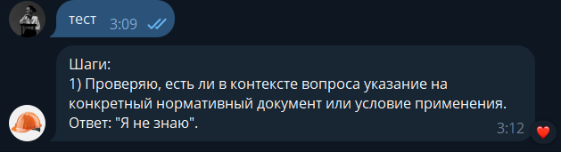

# Задание 1. Исследование моделей и инфраструктуры

Так как подобная задача уже решалась мной в рамках рабочих процессов, в компании запущен проект автоматизации первой линии service desk. В отчёте описываются впечатления от разработки ИИ-агентов в локальной среде и их последующего деплоя на серверах компании. Согласно внутренним политикам безопасности, использование внешних сервисов, в которые могут попасть критичные данные компании, контрагентов и сотрудников, не рекомендуется.

В текущий момент, из-за тестовых нагрузок, принято решение временно отказаться от генеративной LLM в пользу обученного RAG-бота.

Домашнее задание выполнено и описано на базе реального рабочего кейса.


## 1. Сравнение LLM-моделей  
в таблице ниже представлены исследования

___
| Название | Лицензия / Цена | CPU / GPU | Мин. VRAM, GB | Docker | Kubernetes | Поддержка оффлайн инференса | Поддержка локального обучения (LoRA) | Требует обучения для бизнес-качественного ответа | Ограничения по железу | Примечание |
|----------|------------------|-----------|---------------|--------|------------|------------------------------|--------------------------------------|-----------------------------------------------|-----------------------|------------|
| TinyLlama 1.1B | Apache 2.0 / Бесплатно | CPU/GPU | 2 | ✓ | ✓ | Полностью оффлайн | LoRA локально | почти всегда требует доп. обучения | GTX 1050Ti+ (4GB) с 4-bit / CPU ок (медленно) | Для очень слабых машин |
| Phi-3-mini (3.8B) | Apache 2.0 / Бесплатно | CPU/GPU | 4 | ✓ | ✓ | Полностью оффлайн | LoRA локально | желательно для сложных кейсов | GTX 1050Ti+ / GTX 1650, 4–6GB VRAM, CPU ok (с задержками) | Лёгкая модель, минимум ресурсов |
| Mistral 7B Instruct | Apache 2.0 / Бесплатно | CPU/GPU | 8 | ✓ | ✓ | Полностью оффлайн | LoRA локально | желательно для лучшего доменного качества | RTX 2060+ / RTX 3060 12GB (рекоменд.), CPU медленно | Отлично подходит для начала |
| Qwen 1.5 7B Chat | Перmissивная / Бесплатно | CPU/GPU | 8 | ✓ | ✓ | Полностью оффлайн | LoRA локально | желательно для лучшего доменного качества | RTX 2060+ / RTX 3060 12GB+, CPU медленно | Отлично поддерживает русский язык |
| Command R+ | Apache 2.0 / Бесплатно | CPU/GPU | 8 | ✓ | ✓ | Полностью оффлайн | LoRA локально | уже очень хорошо для структурированного вывода | RTX 3060 / 3070 8–12GB+, CPU медленно | Отлично для структурированного вывода |
| Gemma 2B / 7B | Apache 2.0 / Бесплатно | CPU/GPU | 8 | ✓ | ✓ | Полностью оффлайн | LoRA локально | желательно для бизнес-задач | GTX 1660 / RTX 2060+, 8–12GB VRAM, CPU медленно | Чистый open-source от Google |
| Nous Hermes 2 (на Mistral) | Apache 2.0 / Бесплатно | CPU/GPU | 8 | ✓ | ✓ | Полностью оффлайн | LoRA локально | желательно для высокой точности | RTX 3060 12GB+, идеально 3070 / 4060, CPU медленно | Хорошо адаптирован под чат |
| AI Journey 5B | Sber Open License / Бесплатно | CPU/GPU | 12 | ✓ | ✓ | Полностью оффлайн | LoRA локально | желательно для высокой точности в домене | RTX 2060 Super / 3060 (12GB), минимум, CPU долго | Новое, компактное |
| YaLM 8B | Yandex Open License / Бесплатно | CPU/GPU | 16 | ✓ | ✓ | Полностью оффлайн | LoRA локально | желательно для высокой точности в домене | RTX 3060 12GB (очень плотная квантизация), лучше 3070+ / 4060+ | Хорошее понимание русского |
| Mixtral 8x7B | Apache 2.0 / Бесплатно | GPU | 24 | ✓ | ✓ | Полностью оффлайн | LoRA локально | желательно для лучшего доменного качества | RTX 3090 24GB минимум (FP16), 4080+ с квантизацией, A100/A6000 для продакшена | MoE, требует больше VRAM |
| SberGPT 13B | Sber Open License / Бесплатно | CPU/GPU | 24 | ✓ | ✓ | Полностью оффлайн | LoRA локально | желательно для высокой точности в домене | RTX 3090 24GB+ минимум, 3080Ti 12GB (4-bit), CPU тяжело | Отлично для русского языка, гос/корп сценарии |
| Sber ruGPT-3 XL (13B) | Sber Open License / Бесплатно | CPU/GPU | 24 | ✓ | ✓ | Полностью оффлайн | LoRA локально | почти всегда требует обучения | RTX 3090 24GB+, 3080Ti 12GB (4-bit), CPU очень тяжело | Старое, не инструкционное |
| **YandexGPT-5-Lite-8B-instruct (Q4_K_M)** | Yandex Open License / Бесплатно | CPU/GPU | 8 | ✓ | ✓ | Полностью оффлайн (через Ollama) | Ограничено (возможно через адаптацию) | **да, требуется для снижения галлюцинаций** | RTX 2060+ / RTX 3060 12GB рекоменд., CPU возможно с высокой задержкой | Хорошо следует инструкциям, но склонна к галлюцинациям без донастройки |


### 1.1. Рассматриваемые варианты
Рассматривались только варианты, способные работать в оффлайн-режиме на базе Ollama. Кандидатами для отбора стали следующие модели:

* Sber ruGPT-3 XL (13B)
* YandexGPT-5-Lite-8B-instruct-Q4_K_M 

Выбор данных моделей обусловлен тем, что они разработаны российскими компаниями и соответствуют требованиям заказчика по происхождению и контролю технологий.

В результате в качестве основного обрабатывающего модуля, с учётом заявленных заказчиком потребностей, была выбрана модель YandexGPT-5-Lite-8B-instruct-Q4_K_M.

### 1.2. Качество ответов
В ходе тестовой эксплуатации было выявлено, что модель склонна к сильным галлюцинациям и добавляет собственные интерпретации при создании тикетов вместо точной передачи содержимого письма. В настоящее время ведутся работы по доработке промпта, который передаётся модели вместе с телом письма, с целью ограничения произвольных дополнений и повышения точности извлекаемой информации.

### 1.3. Скорость работы
В среднем на локальной машине разработчика с GPU NVIDIA 5060 Ti время ответа модели составляет около 10 секунд.
### 1.4. Стоимость владения и использования

пока что инфраструктура и ее стоимость не расчитывалась тк 

### 1.5. Удобство и простота развёртывания

Для развёртывания потребовалось создать достаточно объёмную инфраструктуру: Ollama была запущена в контейнере, а также реализован shell-скрипт, отвечающий за копирование модели в рабочую директорию и проверку её работоспособности перед запуском инференса.

### 1.6. Вывод по LLM-моделям

Данная модель требует дополнительного дообучения или корректировки весов для снижения уровня галлюцинаций в рамках рассматриваемого кейса. Альтернативный подход — использовать параллельно отдельную модель, обученную на исторических решённых тикетах, а текущую модель исключить из пайплайна и компенсировать её отсутствие более тщательной ручной предобработкой и очисткой входных данных.

---

## 2. Сравнение моделей эмбеддингов  


### 2.1. Рассматриваемые варианты
В рамках текущего кейса классический трансформер для эмбеддингов не использовался. Вместо этого применяется ручная предподготовка текста: очистка тела письма, удаление подписей и цепочек переписки, нормализация и приведение текста к структурированному виду. Данный подход выбран осознанно, так как основной задачей является снижение шума и стабилизация входных данных до этапа дальнейшей обработки, а не семантический поиск по большой базе знаний.

### 2.2. Скорость создания индекса
| Модель | Наблюдения |
|--------|------------|
| Sentence-Transformers | Индексация требует локальных вычислительных ресурсов, время линейно растёт с объёмом данных. При больших объёмах необходим GPU или значительное время на CPU. |
| OpenAI Embeddings | Высокая скорость за счёт облачной инфраструктуры, однако зависит от сетевой задержки и лимитов API. |

### 2.3. Качество поиска
| Модель | Наблюдения |
|--------|------------|
| Sentence-Transformers | Достаточное качество при доменной адаптации, однако без дообучения модель хуже справляется с техническими тикетами и «шумным» текстом. |
| OpenAI Embeddings | Более стабильное качество «из коробки», лучше работает с неструктурированными текстами и сложными формулировками. |
### 2.4. Стоимость владения и использования
| Модель | Наблюдения |
|--------|------------|
| Sentence-Transformers | Низкая стоимость использования, но требуется собственная инфраструктура (CPU/GPU, хранение, обслуживание). |
| OpenAI Embeddings | Отсутствие затрат на инфраструктуру, но постоянные операционные расходы на API и риски роста стоимости при масштабировании. |
### 2.5. Вывод по моделям эмбеддингов
Для текущего этапа проекта использование эмбеддингов признано необходимым на основании изученного материала. Планируется внедрение Sentence-Transformers, так как данный подход позволяет выполнять инференс локально и полностью соответствует требованиям по безопасности и контролю данных.

## 3. Сравнение векторных баз данных  
В проекте уже реализована часть ML-пайплайна на базе векторной СУБД Milvus и документной СУБД MongoDB.

### 3.1. Скорость поиска и индексации
| База данных | Наблюдения |
|-------------|------------|
| ChromaDB | Высокая скорость индексации и поиска на малых и средних объёмах данных, подходит для MVP и локальной разработки; при росте объёма данных производительность начинает снижаться из-за ограничений масштабирования |
| FAISS | Очень высокая скорость поиска при корректно выбранном типе индекса, эффективно работает на больших объёмах, но требует ручной настройки и пересборки индекса при изменениях |
| Milvus | Уже спользуется в проекте, обеспечивает высокую скорость поиска и индексации на больших объёмах данных, поддерживает масштабирование и параллельную обработку запросов |


### 3.2. Сложность внедрения и поддержки
| База данных | Наблюдения |
|-------------|------------|
| ChromaDB | Минимальная сложность внедрения, запускается как библиотека или лёгкий сервис, практически не требует администрирования, но ограничена в возможностях продакшен-эксплуатации |
| FAISS | Требует ручной настройки индексов и управления жизненным циклом данных, отсутствует встроенный persistence, сопровождение усложняется при обновлении и масштабировании |
| Milvus | Более сложен во внедрении, требует развёртывания нескольких компонентов, но обеспечивает полноценную продакшен-эксплуатацию, масштабирование и наблюдаемость |


### 3.3. Удобство в работе
| База данных | Наблюдения |
|-------------|------------|
| ChromaDB | Удобный и простой API, быстрая интеграция, хорошо подходит для прототипирования и локальной разработки, минимальный порог входа |
| FAISS | Низкоуровневая библиотека, требует ручного управления индексами и данными, удобна для исследовательских задач, но неудобна для прикладной разработки |
| Milvus | Предоставляет полноценный API, поддержку коллекций и метаданных, удобен для работы в продакшене, но требует больше усилий на начальную настройку |


### 3.4. Стоимость владения (учёт инфраструктуры)
| База данных | Наблюдения |
|-------------|------------|
| ChromaDB | Минимальная стоимость владения, может работать локально без выделенной инфраструктуры, подходит для MVP и небольших проектов |
| FAISS | Низкая стоимость лицензирования, но требует собственных вычислительных ресурсов и ручного сопровождения, что увеличивает эксплуатационные затраты |
| Milvus | Более высокая стоимость владения из-за необходимости выделенной инфраструктуры и поддержки, однако оправдана при работе с большими объёмами данных и продакшен-нагрузкой |


### 3.5. Вывод по векторным БД
В рамках рабочего кейса в качестве векторной базы данных выбран **Milvus**, так как проект уже реализован на его основе. Milvus обеспечивает требуемую производительность на больших объёмах данных, поддерживает масштабирование и подходит для эксплуатации в продакшене.  
ChromaDB рассматривается как удобный вариант для прототипирования и локальных экспериментов, однако её возможности масштабирования и сопровождения ограничены. FAISS обеспечивает высокую скорость поиска, но является низкоуровневой библиотекой и требует дополнительных усилий по организации persistence и сервисной обвязки, что повышает сложность поддержки.

---

## 4. Рекомендуемая конфигурация сервера для развёртывания RAG-бота

### 4.1. Минимальная конфигурация
- CPU: 8 vCPU  
- RAM: 32 GB  
- GPU: NVIDIA 12 GB VRAM (для локального инференса LLM)  
- Storage: 500 GB SSD (данные Milvus, MongoDB, документы, логи)  
- Обоснование: минимальный профиль для стабильной работы RAG-пайплайна и тестовой эксплуатации при умеренных объёмах данных.

### 4.2. Рекомендуемая конфигурация
- CPU: 16 vCPU  
- RAM: 64 GB  
- GPU: NVIDIA 16 GB VRAM  
- Storage: 1 TB NVMe SSD  
- Обоснование: сбалансированный вариант для продакшен-нагрузки, устойчивее к росту коллекций Milvus и параллельным запросам, снижает задержки инференса.

### 4.3. Конфигурация с запасом на рост
- CPU: 32 vCPU  
- RAM: 128 GB  
- GPU: NVIDIA 24 GB VRAM  
- Storage: 2 TB NVMe SSD (+ отдельный диск/том под бэкапы)  
- Обоснование: профиль под рост объёмов векторного индекса и числа одновременных пользователей; снижает риски упора в RAM/IO и позволяет использовать более тяжёлые модели или менее агрессивную квантизацию.


# Задание 2. Подготовка базы знаний для RAG


## 1. Выбор предметной области
В качестве предметной области для обучения выбраны нормативные и регулирующие документы строительной отрасли, применимые к проектированию и эксплуатации многоквартирных домов.

### 1.1. Предметная область
База знаний формируется на основе **строительных норм и правил** (СНиП, СП, ГОСТ, внутренние регламенты и технические требования).

### 1.2. Типы сущностей
- Нормативные документы  
- Разделы нормативов  
- Пункты требований  
- Таблицы допустимых значений  
- Исключения и примечания  
- Условия применения норм  

### 1.3. Объём базы
- Количество документов: 30+  
- Формат: текстовые нормативные фрагменты (snippets)

---

## 2. Сбор и очистка текстов

### 2.1. Источник данных
В качестве источника данных для базы знаний используются тексты строительных норм, размещённые на сайте `http://sniprf.ru/snip`.  
Данные извлекаются из открытых страниц, приводятся к чистому тексту и нарезаются на сниппеты для последующей индексации в RAG.

### 2.2. Способ получения данных
- Метод: парсинг HTML-страниц  
- Инструменты: Python (requests, BeautifulSoup)  
- Формат исходных данных: HTML → TXT / MD  

### 2.3. Очистка и нормализация
- Удаление HTML-разметки и навигационных блоков  
- Удаление оглавлений, ссылок, повторяющихся элементов  
- Нормализация структуры пунктов и подпунктов  
- Приведение текста к единому стилю  

### 2.4. Разбиение на сниппеты
- Один сниппет = один логически завершённый пункт нормы  
- Размер сниппета: 300–500 токенов  
- Сниппеты формируются с учётом контекста применения нормы  

---

## 3. Подмена терминов (создание уникального корпуса)

### 3.1. Причина подмены
Оригинальные строительные нормы могли частично присутствовать в обучающих данных LLM. Для проверки корректной работы RAG все ключевые термины подменяются, чтобы исключить угадывание по памяти модели.

### 3.2. Принцип подмены
- Названия СНиП / СП → вымышленные кодексы  
- Номера разделов → псевдо-идентификаторы  
- Термины материалов и конструкций → нейтральные аналоги  
- Ссылки на организации → обобщённые сущности  

### 3.3. Словарь замен
Файл: `terms_map.json`

Пример:
```json
{
  "СНиП 2.03.01-84": "BN-Core-01",
  "СП 63.13330": "BN-Struct-63",
  "железобетон": "композитный материал класса A",
  "несущая конструкция": "опорный элемент типа N"
}
````

### 3.4. Проверка корректности текстов

* Тексты остаются читаемыми и логичными
* Исключена узнаваемость оригинальных нормативов
* Сохраняется технический смысл требований

---

## 4. Формирование финальной базы знаний

### 4.1. Структура папки

```
knowledge_base/
├── norms/
│   ├── norm_001.txt
│   ├── norm_002.txt
│   ├── norm_003.txt
│   └── ...
├── terms_map.json
└── README.md
```

### 4.2. Формат документов

Каждый файл содержит:

* Текст нормы
* Условия применения
* Ограничения
* Примечания

### 4.3. Принцип именования

* norm_XXX.txt — уникальный идентификатор
* Идентификатор связан с metadata в векторной БД

---

## 5. Подготовка базы к индексации (snippets)

### 5.1. Метаданные сниппетов

* norm_id
* section
* applicability
* source
* version

### 5.2. Причина выбора сниппетов

Использование сниппетов позволяет:

* Минимизировать галлюцинации
* Повысить точность retrieval
* Обеспечить трассируемость ответа
* Упростить обновление нормативов

---

## 6. Проверка корректности работы RAG

### 6.1. Контрольные запросы

* Вопросы на конкретные нормы
* Вопросы с условиями применения
* Вопросы с исключениями и ограничениями

### 6.2. Проверка использования индекса

* Анализ top-k retrieved snippets
* Сравнение ответа с извлечёнными нормами
* Исключение ответов без обращения к базе

---

## 7. Итог по заданию 2

### 7.1. Результат

* Подготовлена уникальная база строительных норм
* Все документы представлены в виде сниппетов
* Реализована подмена терминов
* База пригодна для честного RAG-тестирования

### 7.2. Преимущества решения

* Полный контроль над знаниями
* Соответствие корпоративным требованиям безопасности
* Снижение риска галлюцинаций
* Масштабируемость базы

# Задание 4. Реализация RAG-бота с техниками промптинга

## 1. Цель и ограничения
### 1.1. Цель
- Реализовать работающий RAG-бот, который:
  - ищет релевантные фрагменты в векторной базе;
  - формирует ответ строго на основе найденных фрагментов;
  - использует Few-shot и “объяснение шагов” (CoT в виде краткой трассировки);
  - умеет отвечать «Я не знаю», если контекст не найден/недостаточен.

### 1.2. Ограничения
- Энкодер эмбеддингов: тот же, что при индексации (Sentence-Transformers).
- Векторная БД: FAISS (локально).
- LLM: локальная (например, через Ollama) / или облачная (опционально).

---

## 2. Архитектура пайплайна RAG
### 2.1. Поток обработки
1) Ввод запроса пользователя  
2) Эмбеддинг запроса (Sentence-Transformers)  
3) Поиск top-k в FAISS  
4) Формирование контекстного промпта (контекст + few-shot)  
5) Вызов LLM (Ollama / OpenAI / YandexGPT)  
6) Постобработка:
   - проверка, что ответ опирается на контекст
   - возврат «Я не знаю» при недостаточном контексте

### 2.2. Артефакты
- `knowledge_base/faiss.index`
- `knowledge_base/snippets_meta.jsonl`
- `knowledge_base/snippets/*.txt`

---

## 3. Реализация поиска (FAISS)
### 3.1. Параметры retrieval
- `top_k`:  
- метрика: cosine (через L2-normalize + inner product)  
- порог релевантности `min_score`:  

### 3.2. Логика “Я не знаю”
- Условие 1: top-1 score < `min_score`
- Условие 2: суммарно мало релевантных чанков (например, < 2)
- Условие 3: контекст не покрывает вопрос по ключевым словам/сущностям

---

## 4. Промптинг
### 4.1. System prompt (роль + контроль галлюцинаций)
- Требования:
  - отвечать только по CONTEXT
  - если данных нет — «Я не знаю»
  - “CoT” реализовать как короткую трассировку 2–4 пункта (не развёрнутые рассуждения)

### 4.2. Few-shot prompting
- Примеры должны быть из предметной области базы (строительные нормы)
- Желательно: примеры берутся из извлечённых сниппетов (retrieved), а не “из головы”

#### Few-shot Example 1
Q:  
A:  

#### Few-shot Example 2
Q:  
A:  

### 4.3. Финальная структура промпта
- SYSTEM:
- FEW-SHOT:
- CONTEXT (top-k snippets):
- USER QUESTION:

---

## 5. Интерфейс
Выбранный вариант:
- [ ] REPL (консоль)
- [ ] REST API (FastAPI)
- [ ] Telegram bot

Описание запуска:
- команда запуска:
- параметры окружения:

---

## 6. Результаты и примеры диалогов
### 6.1. Успешные диалоги (3–5)
1) Q:  
   A:  
2) Q:  
   A:  
3) Q:  
   A:  

### 6.2. Случаи «Я не знаю» (1–2)
1) Q:  
   A: Я не знаю.  
2) Q:  
   A: Я не знаю.  




